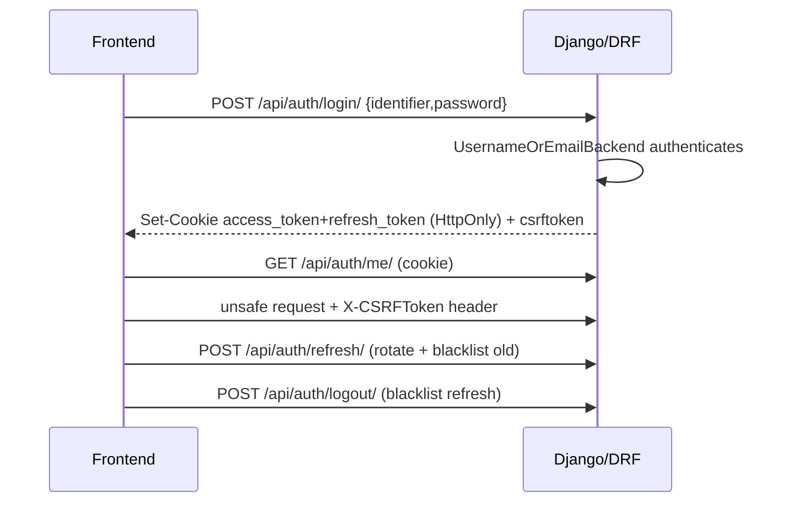
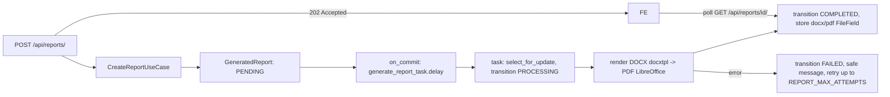

# Codebase Map

Audit date 2026-07-28. Describes **actual** behavior of the repository (source of truth),
not the requirements documents. Cross-references: `../CLAUDE.md`,
`ENGINEERING_BACKLOG.md`.

## Runtime components
Defined in `docker-compose.yml`:

- **db** — `postgres:16`.
- **redis** — `redis:7`; Celery broker (no result backend; PostgreSQL holds report state).
- **setup** — one-shot: `migrate` + `seed_initial_data`.
- **backend** — `gunicorn config.wsgi` (3 workers), port 8000; health `/health/ready`.
- **worker** — `celery -A config worker` (concurrency 2). No Celery Beat.
- **frontend** — Next.js dev server, port 3000.

Files are written to a local `backend_media` volume through Django `FileField`
(`MEDIA_ROOT`). There is **no S3/MinIO** despite the storage-abstraction docstring.

## Backend modules & responsibilities (Django app `reports`)
- **models.py** — the whole schema: `ReportType`, `ReportTemplateVersion`,
  `GeneratedReport`, `AuditEvent`, `ServiceCategory`, `Service`,
  `UserServiceRestriction`, `UserCategoryRestriction`, `UserAdministration`.
  User model is Django's default `auth.User` (no custom user model);
  `UserAdministration` is a OneToOne side-table (phone, disabled_reason/at/by).
- **accounts/** — `LoginView` (identifier = username or email via
  `UsernameOrEmailBackend`), `RefreshView`, `LogoutView`, `MeView`, `RegisterView`.
  `CookieJWTAuthentication` reads the access token from an HttpOnly cookie; refresh
  rotation + blacklist enabled. Login/refresh have dedicated throttle scopes.
- **catalog/** — `ReportType` read API (`ReportTypeViewSet`); template-version lifecycle
  use cases (`application.py`), schema `validation.py`, DOCX `security.py`
  (zip-slip/zip-bomb/macro scan), `selectors.active_version`.
- **generation/** — core flow. `views.py` (create=202, list, retry, download) →
  `application.py` use cases → `domain.py` state machine → `tasks.py` (Celery). Ownership
  filtered in `selectors.reports_for`; object-level `IsOwnerOrAdmin`.
- **services_catalog/** — `ServiceViewSet` (list/detail + `launch` action) and
  `policy.py` (`service_access_for`) — the access decision engine.
- **dashboard/** — user dashboard aggregates (`selectors.py`, DB-side `Count`).
- **excel_contacts/** — authenticated synchronous Excel/VCF processing behind the
  centralized service-access policy; validates signatures and bounded workbook limits,
  returns an in-memory ZIP, and records `service.execute`.
- **admin_api/** — `/api/v1/admin/*`: Users, Services, Jobs, Audit-logs, Report-types
  viewsets + Dashboard + Analytics; `permissions.py` (admin gate, last-admin protection).
- **audit/** — `AuditEvent` writer (`service.py`, `actions.py`).
- **services/** — `report_generation.py`, `pdf_converter.py`: LibreOffice/subprocess
  boundary (PDF conversion). `ReportGenerationService.generate()` is **unused** (see backlog C8).
- **shared/** — `storage.DocumentStorage`, `permissions`, `errors`/`exceptions`,
  `exception_handler` (unified `{error:{code,message,...}}`), structured JSON `logging`,
  `correlation` middleware (correlation IDs).

### Dependency direction
Views depend inward on `application` → `domain`; reads via `selectors`. `admin_api`
consumes `models` + `audit` + `catalog`/`generation` selectors. `shared` is leaf-level.
No custom-user override; all modules reference `settings.AUTH_USER_MODEL` (= `auth.User`).

## Frontend routes & feature boundaries (`frontend/src/app`)
User: `/login`, `/register`, `/dashboard`, `/profile`, `/services`, `/report-types`,
`/reports`, `/reports/[id]`, `/reports/new`, `/tools/excel-contacts`.
Admin (`/admin`): `analytics`, `audit-logs`, `categories`, `jobs`, `services`,
`services/[id]`, `settings`, `users`, `users/[id]`.
Feature boundaries: `shared/api/client.ts` (fetch + CSRF + error normalization),
`shared/auth/*` (session/user), `shared/admin/useAdminList.ts` (shared admin list/paginate),
`features/*` (auth, dashboard, report-catalog, report-generation, reports-history), and
`features/excel-contacts/api.ts` (authenticated Django upload contract).

## Authentication flow

Access token lifetime 15 min, refresh 7 days. Note: auth/report endpoints are **unversioned**
(`/api/...`); only admin is versioned (`/api/v1/admin/...`).

## Internal report (job) execution flow

State machine (`domain.py ALLOWED_TRANSITIONS`) is the only place transitions occur.
There is no generic Job/Asset model — job fields live on `GeneratedReport`.

## External-service launch flow
`POST /api/services/{slug}/launch/` → checks access via `service_access_for` → writes an
`AuditEvent` `service.launch` → returns `{target, kind}`. Frontend performs the redirect.
Open-redirect is mitigated at write time: `Service.clean()` requires external targets to be
HTTPS and internal targets to start with `/`; users never supply the URL. Usage analytics
are reconstructed from `AuditEvent` rows (there is no `ServiceUsageEvent` table).

## Excel Contacts execution flow
`POST /api/tools/excel-contacts/process/` authenticates via the normal cookie/CSRF
boundary, then the focused use case resolves `whatsapp-contacts` and calls
`service_access_for`. A size/signature/dimension-bounded synchronous processor reads the
first worksheet, returns the existing ZIP/summary/preview shape, and records
`service.execute`. No input/output is persisted because the platform has no generic
Job/Asset model.

## Admin request flow
`/api/v1/admin/*` viewsets are gated by an admin permission class (`admin_api/permissions.py`)
enforced server-side. Sensitive mutations (activate/deactivate service, user activate/
deactivate, bulk restrictions) run in `transaction.atomic` and write `AuditEvent`s.
Last-admin/self-deactivation is blocked (tested). **Gap:** generic `PATCH` on the admin
Service/ReportType viewsets and Django `admin.py` can flip `is_active`/`status` directly,
skipping the audited action and its metadata (see backlog).

## Job & asset lifecycle
`GeneratedReport.status`: PENDING → PROCESSING → COMPLETED | FAILED (retry increments
`attempts`). `queued_at/started_at/finished_at` timestamps recorded. Output DOCX/PDF are
`FileField`s; downloads go through `IsOwnerOrAdmin` + `DocumentStorage`. Stuck reports are
recovered by the `recover_stuck_reports` management command. There is no temporary-asset
expiry/retention job.

## Important integrations
- **LibreOffice** (subprocess) for DOCX→PDF, behind `services/pdf_converter.py`.
- **docxtpl/python-docx** for template rendering.
- **Redis/Celery** for async generation.
- **openpyxl/xlrd/defusedxml** (backend) for bounded Excel Contacts parsing and output.

## Where implementation differs materially from the requirements
- No **custom User model** — default `auth.User` + `UserAdministration` side-table.
- No **object storage / Asset model** — local `FileField` on `backend_media`.
- No generic **Job model** or **Tool Registry** — a single report-generation pipeline.
- No **ServiceUsageEvent** — usage/analytics derived from `AuditEvent`.
- **`UserCategoryRestriction` is modeled but never enforced or writable** (no policy/API
  reads or writes it) — category-level blocking is a no-op (backlog P1).
- **Template versioning + DOCX security scanner exist but are unreachable via any API**
  (only unit-tested) — effectively dead code (backlog).
- **API versioning is inconsistent** — admin is `/api/v1/`, auth/reports are `/api/`.
