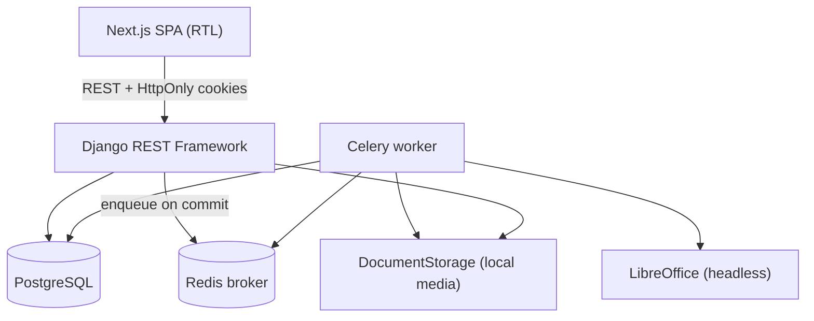
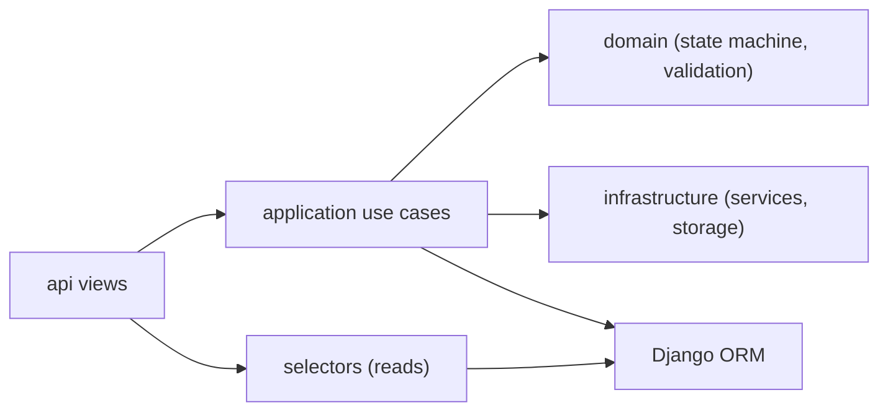
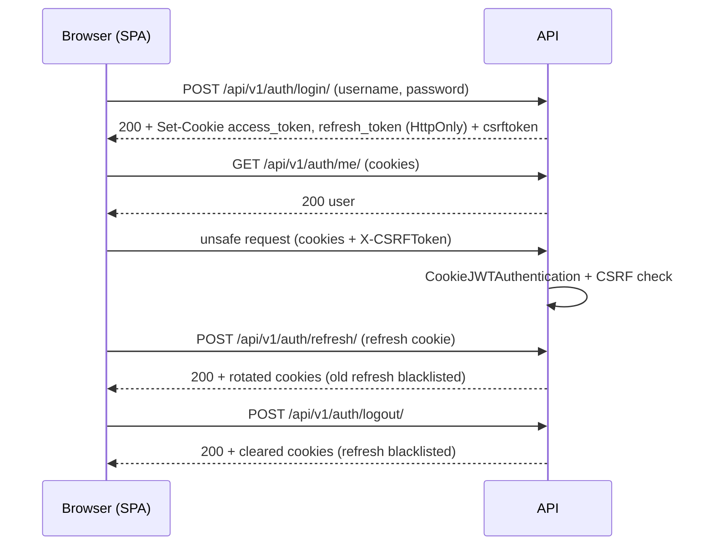
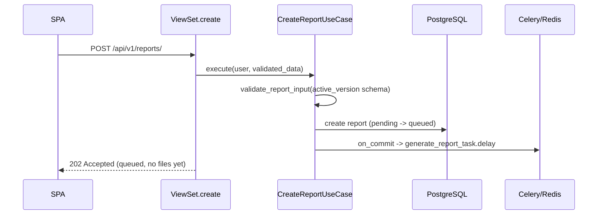
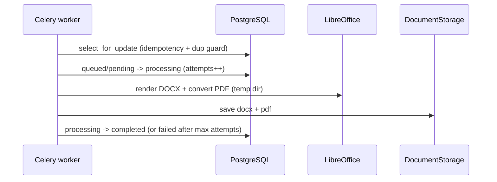
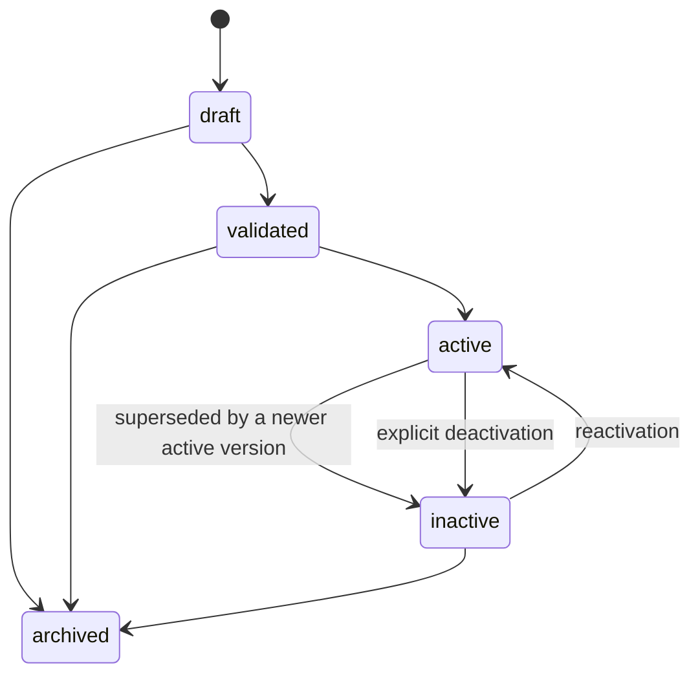
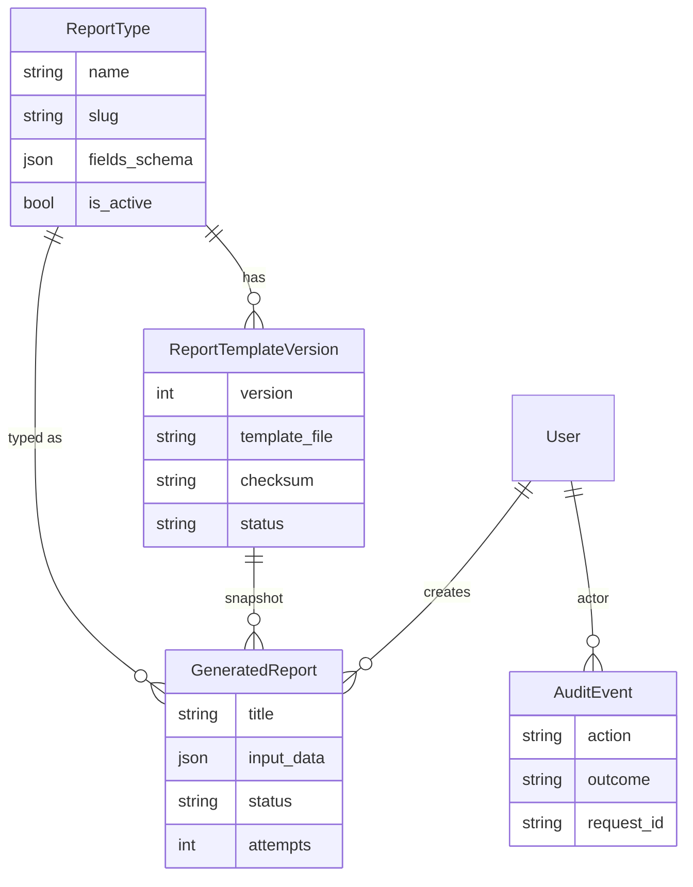
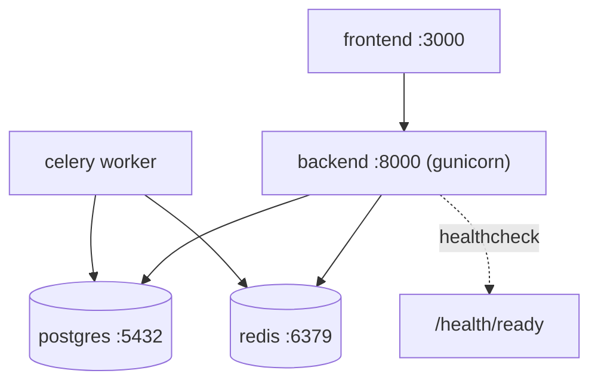

# Architecture

Authoritative description of the **Professional Reports** platform as it exists in the
code today. Keep this file in sync with the code — update it in the same change that
alters the architecture, and add an ADR (`docs/decisions/`) for significant decisions.

## 1. Purpose of the system

An internal platform that generates professional **Word (DOCX)** and **PDF** reports from
pre-built DOCX templates and user-supplied form data. Users pick a report type, fill a
dynamic form, submit, and download the generated files once ready.

## 2. Architecture goals

- Clear module boundaries so a new developer knows where each concern lives.
- Preserve existing behavior and data; change only for a documented security/architecture reason.
- Maintainable and extensible for years without a rewrite and without microservices.
- Backend is the single source of truth for validation, state, and permissions.

## 3. Why a Modular Monolith

One deployable Django project split into feature modules with explicit boundaries. This
gives most of the clarity of services without their operational cost (network, distributed
transactions, deployment complexity). See [ADR-001](decisions/ADR-001-modular-monolith.md).

## 4. High-level components



## 5. Backend structure

Single Django app `reports` (owns the tables) organized into feature packages:

```text
backend/
├── config/                 # settings, urls, wsgi/asgi, celery, health
└── reports/
    ├── models.py           # ReportType, ReportTemplateVersion, GeneratedReport, AuditEvent
    ├── migrations/
    ├── shared/             # errors, exceptions, correlation, exception_handler,
    │                       # permissions, storage, logging  (cross-cutting only)
    ├── accounts/           # auth: authentication, cookies, throttling, views, serializers
    ├── catalog/            # report types + template versions: validation, placeholders,
    │                       # security scanner, application (activation), selectors, views
    ├── generation/         # reports: domain (state machine), application (use cases),
    │                       # tasks (celery), selectors, serializers, views
    ├── dashboard/          # read-only stats: selectors, views
    ├── excel_contacts/     # bounded authenticated spreadsheet processing
    ├── audit/              # audit actions + recording service
    ├── services/           # report_generation, pdf_converter (generation infrastructure)
    ├── management/commands # seed_initial_data, seed_dev_data, recover_stuck_reports
    └── tests/
```

Module ↔ spec mapping: `catalog` = report catalog + template versioning; `generation` =
report generation. Models stay in the `reports` app (tables unchanged) — see ADR-001.

## 6. Frontend structure

```text
frontend/src/
├── app/                    # Next.js routes (thin composition)
├── features/
│   ├── auth/               # useLogin
│   ├── report-catalog/     # useReportTypes
│   ├── report-generation/  # useCreateReport, useReportStatus (polling)
│   ├── excel-contacts/     # authenticated processing API boundary
│   ├── reports-history/    # useReports
│   └── dashboard/          # useDashboard
├── shared/
│   ├── api/                # client (fetch wrapper), types
│   ├── auth/               # AuthContext, useRequireAuth
│   └── errors/             # ApiError
├── components/             # presentational components
└── lib/                    # deprecated re-export shims -> shared/*
```

The `/admin` route tree has an independent `AdminChrome`, sidebar, top bar, and route
guard. It never reuses the normal user navigation. An authenticated staff or superuser
is redirected to `/admin` after login; non-admin users are redirected to `/dashboard`.

## Admin control center

All application endpoints use the canonical `/api/v1/` namespace. Temporary `/api/...`
aliases resolve to the same views for backward compatibility and are excluded from the
canonical schema route inventory. Infrastructure health routes remain unversioned.
Administrative endpoints live under `/api/v1/admin/` and share the
`IsPlatformAdmin` permission. The admin API owns operational reads and audited,
transactional administrative writes:

- user activation, deactivation, and scheduled or permanent service restrictions;
- service activation, deactivation, configuration, and access metrics;
- report job monitoring, retry, and cancellation;
- analytics, audit events, and full report template management.

Administrative metadata is kept in `UserAdministration`, leaving Django's authentication
user model stable. Restrictions support an optional expiry and are ignored by the
service access policy after expiry. Sensitive state changes require a reason and write
an append-only `AuditEvent`.

The public landing page and service catalog are available without authentication.
`GET /api/v1/services/` and service detail reads expose active catalog metadata to
anonymous visitors, while launch and execution endpoints remain authenticated and
continue to use the centralized service-access policy. Anonymous catalog responses mark
services as requiring sign-in; they never expose a launch target.

## 7. PostgreSQL

Default database in development, tests, and CI. Connection from `DATABASE_URL` or
`POSTGRES_*`. `USE_TZ=True` stores UTC; `TIME_ZONE` defaults to UTC. There is **no SQLite**
in the project (the sandbox smoke DB is separate and not part of the repo).

## 8. Redis & Celery

Redis is the Celery broker. The Celery result backend is **disabled**: PostgreSQL is the
single source of truth for report state. Tasks are enqueued via `transaction.on_commit`
so the worker never starts before the report row is committed.

## 9. Module boundaries

- Modules talk to each other only through **public selectors / application use cases**
  (e.g. `dashboard` reads via `generation.selectors.reports_for`).
- `shared/` holds only genuinely cross-cutting code (errors, correlation, storage,
  permissions, logging). It is not a dumping ground.

## 10. Responsibility of each module

| Module | Responsibility |
|---|---|
| `accounts` | Login/logout/refresh/me, cookie JWT authentication, CSRF, throttling, roles/permissions surface |
| `catalog` | Report types, `fields_schema` validation, template versions, placeholder + DOCX security validation, activation |
| `generation` | Report creation use case, state machine, async generation task, retries, selectors, serializers, downloads |
| `dashboard` | Read-only aggregated statistics |
| `excel_contacts` | Authorized, bounded Excel contact normalization and in-memory result packaging |
| `audit` | Recording + canonical names for security/admin events |
| `shared` | Error model, correlation id, storage abstraction, permissions, logging |
| `services` | Generation infrastructure: DOCX render (docxtpl), LibreOffice PDF conversion |

## 11. Dependency rules



- Writes: **View → Input Serializer → Use Case → Domain → ORM/Infra → Output Serializer**.
- Reads: **View → Selector → Output Serializer**.

## 12. Allowed / forbidden per layer

- **Views**: no business logic; parse input, call a use case or selector, serialize output.
- **Serializers**: shape + light field validation only; no workflow.
- **Use cases**: orchestrate domain + infra; own transactions and enqueuing.
- **Domain**: pure rules (state transitions, schema validation).
- **Infrastructure**: LibreOffice, storage, external boundaries — behind interfaces.
- Forbidden: business logic in views/serializers/React components; `FileField.path` or
  `MEDIA_ROOT` in business logic; cross-module private imports; abstractions without a real use.

## 13. Authentication flow



## 14. Report creation flow



## 15. Background generation flow



## 16. Polling flow

The SPA `useReportStatus` polls `GET /api/v1/reports/{id}/status/` every ~2s, stops on
`completed/failed/cancelled`, cleans up on unmount, and backs off (bounded) on transient
network errors. No WebSockets.

## 17. Template upload & validation flow

Admin uploads enter through the admin-only multipart endpoint and are persisted with
non-guessable storage keys behind `DocumentStorage`. Upload performs bounded structural
DOCX scanning; the explicit validate action checks the schema, placeholders, and checksum.
Failed persistence removes the uploaded blob. There is intentionally no public template
upload or permanent public file URL.

## 18. Template versioning flow



Activation locks the report type and its versions in one transaction; a conditional unique
constraint enforces at most one active version per report type. Validated and historical
versions are immutable in impactful fields (`template_file`, `fields_schema`, `checksum`);
changes require a new version. New reports require an active version with a checksum and
retain that version through `PROTECT`, including after it is deactivated or archived.

## 19. Secure file download flow

`GET /api/v1/reports/{id}/download-docx|download-pdf` → object permission (`IsOwnerOrAdmin`) →
existence check via `DocumentStorage.exists` → stream via `DocumentStorage.open` with a
sanitized `Content-Disposition` filename. No public/static file URLs.

## 20. Database ownership

All tables belong to the `reports` app. Table names are unchanged from the MVP
(`reports_reporttype`, `reports_generatedreport`, plus new `reports_reporttemplateversion`,
`reports_auditevent`).

## 21. Main models & relationships



## 22. Report status transitions

`pending → queued → processing → completed | failed | cancelled`. Retries: `processing → queued`.
Terminal: `completed`, `cancelled` (and `failed` unless retried). Enforced in
`generation/domain.py`; illegal transitions raise `InvalidStateTransition`.

## 23. Template status transitions

`draft → validated → active → inactive`; `draft → rejected`. See §18.

## 24. Error-handling strategy

Single error model `{code, message, request_id[, details]}` produced by
`shared/exception_handler.py`. Internal details (tracebacks, paths, LibreOffice/DB errors)
are logged, never returned. Domain errors carry a machine `code` + safe message + HTTP status.

## 25. Logging strategy

Structured JSON (`shared/logging.py`) with `correlation_id` on every line; extra fields
(`report_id`, `task_id`, `action`, ...) when provided. `DJANGO_LOG_FORMAT=plain` for local dev.

## 26. Audit strategy

Append-only `AuditEvent` for security/admin actions (login, logout, refresh, report create,
generation complete/fail, download, template activation). Read-only in admin; no secrets or
full input stored. See `permissions-matrix.md` and `security.md`.

## 27. Testing strategy

See `testing-strategy.md`. Backend: pytest + pytest-django on PostgreSQL (CI); characterization
tests guard behavior; Celery eager + captured `on_commit` for async paths. Frontend: Vitest
unit tests + `tsc` + `next build`.

## 28. Local development topology



## 29. Backup & restore architecture

`pg_dump` custom-format backups + `pg_restore` (to a separate DB by default). Media files
are backed up separately from the database. See `backup-and-restore.md`.

## 30. How to add a feature

See `adding-a-feature.md`.

## 31. Full example: a new use case

See `adding-a-feature.md` (worked example: adding a "cancel report" use case).

## 32. Naming conventions

- Modules: business nouns (`catalog`, `generation`, `dashboard`).
- Use cases: `VerbNounUseCase` (`CreateReportUseCase`). Selectors: `verb_noun(...)`.
- Audit actions: dotted (`report.created`). Error codes: `UPPER_SNAKE`.

## 33. Import rules

Cross-module access only through public selectors/use cases. No importing another module's
`views`/`serializers`/private helpers. `shared` may be imported anywhere; `shared` imports
no feature module.

## 34. Forbidden anti-patterns

Business logic in views/serializers/components; `FileField.path`/`MEDIA_ROOT` in business
logic; tokens in `localStorage`; HTTP requests waiting on PDF generation; a repository
interface per model; abstractions with no real user; disabling CSRF to "fix" auth.

## 35. Remaining technical debt

See the "Remaining technical debt" section of `final-refactor-report.md` and
`deferred-features.md`.

## 36. ADRs

See `docs/decisions/` — ADR-001…ADR-008.

## 37. Excel Contacts processing flow

`POST /api/v1/tools/excel-contacts/process/` authenticates with the normal cookie/CSRF
boundary, resolves the `whatsapp-contacts` service, and delegates authorization to
`services_catalog.policy.service_access_for`. A focused use case validates the upload
and invokes the bounded workbook processor. The synchronous response preserves the
existing ZIP/summary/preview contract; no input or output is persisted because the
verified platform has no generic Job or Asset model. Success, denial, and failure are
recorded as `service.execute` audit events without workbook contents or contact data.
